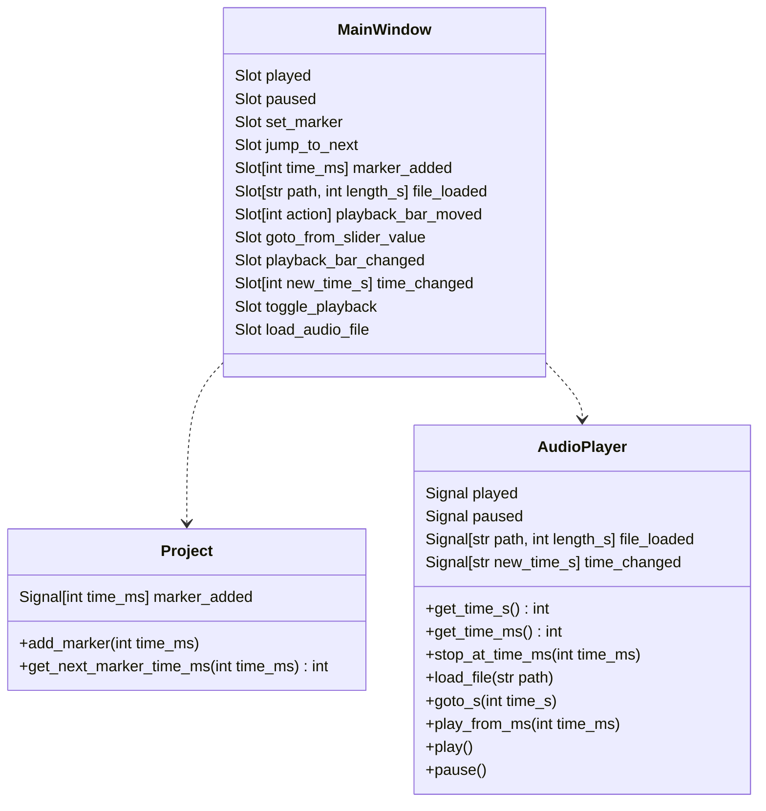
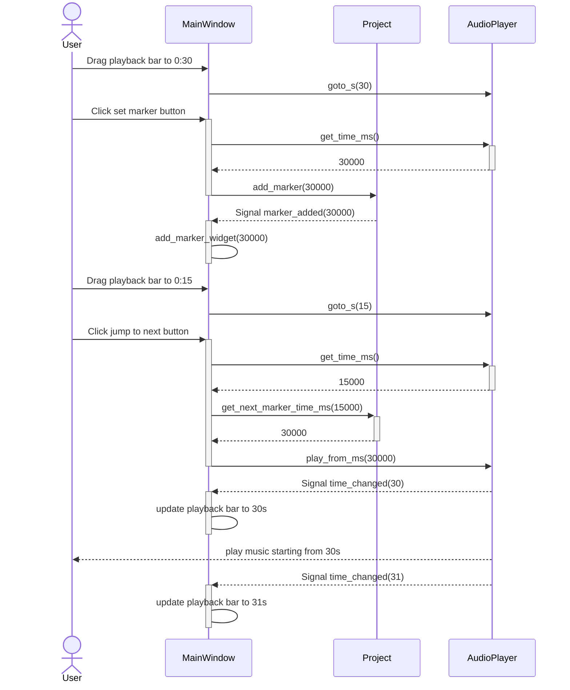

# Luokkakaavio

```mermaid
classDiagram
    MainWindow..>Project
    MainWindow..>AudioPlayer
    class MainWindow{
        Slot played
        Slot paused
        Slot set_marker
        Slot jump_to_next
        Slot[int time_ms] marker_added
        Slot[str path, int length_s] file_loaded
        Slot[int action] playback_bar_moved
        Slot goto_from_slider_value
        Slot playback_bar_changed
        Slot[int new_time_s] time_changed
        Slot toggle_playback
        Slot load_audio_file
    }
    class Project{
        Signal[int time_ms] marker_added
        +add_marker(int time_ms)
        +get_next_marker_time_ms(int time_ms) int
    }
    class AudioPlayer{
        Signal played
        Signal paused
        Signal[str path, int length_s] file_loaded
        Signal[str new_time_s] time_changed
        +get_time_s() int
        +get_time_ms() int
        +stop_at_time_ms(int time_ms)
        +load_file(str path)
        +goto_s(int time_s)
        +play_from_ms(int time_ms)
        +play()
        +pause()
    }
```

# Sekvenssikaavio 

```mermaid
sequenceDiagram
    actor User
    participant MainWindow
    participant Project
    participant AudioPlayer
    User->>MainWindow: Drag playback bar to 0:30
    MainWindow->>AudioPlayer: goto_s(30)
    User->>+MainWindow: Click set marker button
    MainWindow->>+AudioPlayer: get_time_ms()
    AudioPlayer-->>-MainWindow: 30000
    MainWindow->>-Project: add_marker(30000)
    Project-->>+MainWindow: Signal marker_added(30000)
    MainWindow->-MainWindow: add_marker_widget(30000)
    User->>MainWindow: Drag playback bar to 0:15
    MainWindow->>AudioPlayer: goto_s(15)
    User->>+MainWindow: Click jump to next button
    MainWindow->>+AudioPlayer: get_time_ms()
    AudioPlayer-->>-MainWindow: 15000
    MainWindow->>+Project: get_next_marker_time_ms(15000)
    Project-->>-MainWindow: 30000
    MainWindow->>-AudioPlayer: play_from_ms(30000)
    AudioPlayer-->>+MainWindow: Signal time_changed(30)
    MainWindow->-MainWindow: update playback bar to 30s
    AudioPlayer-->>User: play music starting from 30s
    AudioPlayer-->>+MainWindow: Signal time_changed(31)
    MainWindow->-MainWindow: update playback bar to 31s

```
