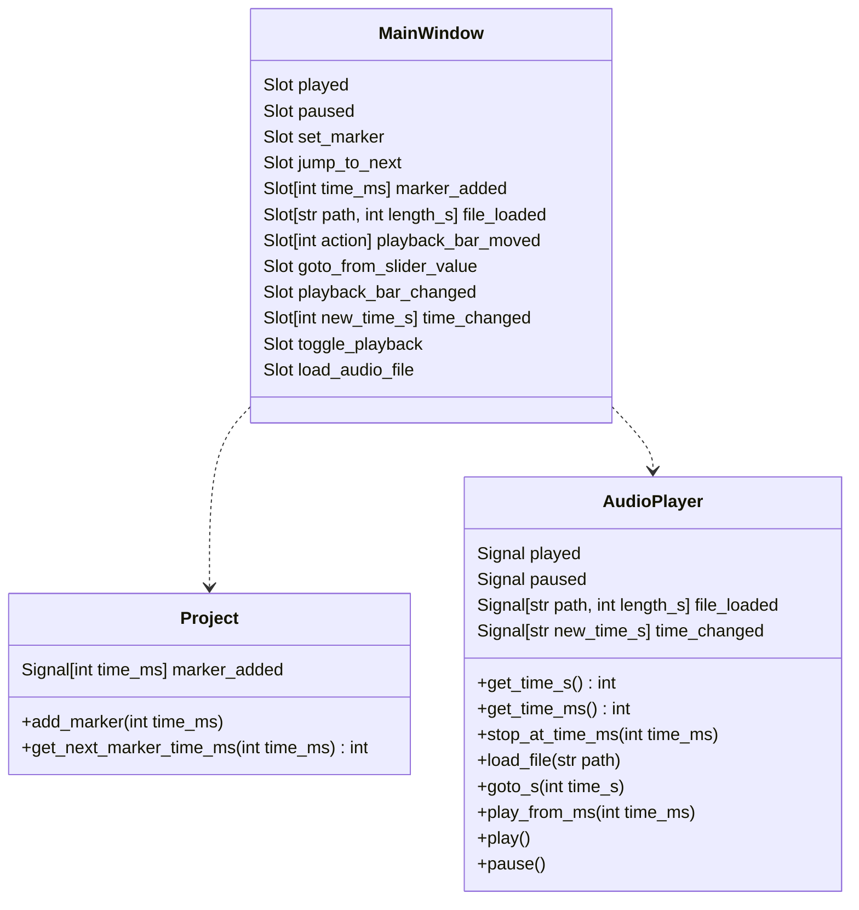

```mermaid
classDiagram
    MainWindow..>Project
    MainWindow..>AudioPlayer
    class MainWindow{
        Slot played
        Slot paused
        Slot set_marker
        Slot jump_to_next
        Slot[int time_ms] marker_added
        Slot[str path, int length_s] file_loaded
        Slot[int action] playback_bar_moved
        Slot goto_from_slider_value
        Slot playback_bar_changed
        Slot[int new_time_s] time_changed
        Slot toggle_playback
        Slot load_audio_file
    }
    class Project{
        Signal[int time_ms] marker_added
        +add_marker(int time_ms)
        +get_next_marker_time_ms(int time_ms) int
    }
    class AudioPlayer{
        Signal played
        Signal paused
        Signal[str path, int length_s] file_loaded
        Signal[str new_time_s] time_changed
        +get_time_s() int
        +get_time_ms() int
        +stop_at_time_ms(int time_ms)
        +load_file(str path)
        +goto_s(int time_s)
        +play_from_ms(int time_ms)
        +play()
        +pause()
    }
```
