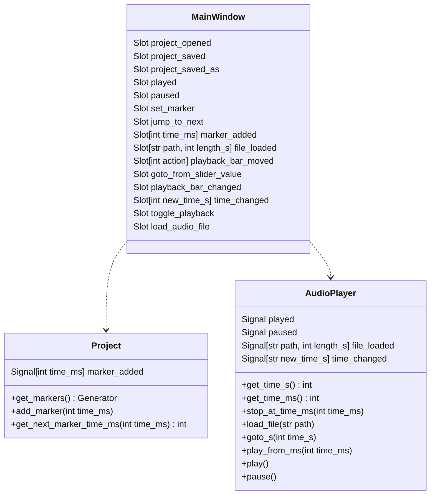

# Arkkitehtuurikuvaus

`MainWindow` luokka käyttää `AudioPlayer` luokkaa äänentoistoon ja `Project` luokkaa markerien tallentamiseen. `Project` luokan `get_next_marker_time_ms` metodin avulla voidaan selvittää, milloin nykyisestä soittoajankohdasta seuraava marker on. Tällä `AudioPlayer` voidaan määrätä pysähtymään metodia `stop_at_time_ms` käyttäen, tai sitten hyppäämään siihen markeriin metodia `play_from_ms` käyttäen. Luokka `ProjectPersistence` hoitaa markerprojektin tallentamisen ja lataamisen tiedostoon.


## Luokkakaavio



## Hyppääminen seuraavaan markeriin

Tässä kaaviossa kuvataan, miten `MainWindow` kysyy `Project`:ilta seuraavan markkerin ajankohtaa, jonka se lähettää `AudioPlayer`:ille. Lopussa myös huomataan, miten `AudioPlayer` lähettää nykyisen ajan päivityksiä `MainWindow`:ille.


## Pysyväistallennus

`ProjectPersistence` hoitaa markerprojektien pysyväistallennuksen. Projektitiedosto on binäärimuotoinen. Sillä on seuraava muoto:

```
formaatin tunniste      | formaatin versio | audio-tiedoston polku (c-string) | marker (ms) | marker (ms) | marker (ms) | marker (ms) |
bb 5d c6 89 7e 06 4b d5 | 00 01            | 2f 61 75 64 69 6f 2e 64 70 33 00 | 00 00 00 64 | 00 00 00 c8 | 00 00 01 f4 | etc.        |
```

Formaatti mahdollistaa muutokset binäärimuotoon, taaten yhteensopivuuden vanhojen tiedostojen kanssa, jos formaatti muuttuu myöhemmin.
