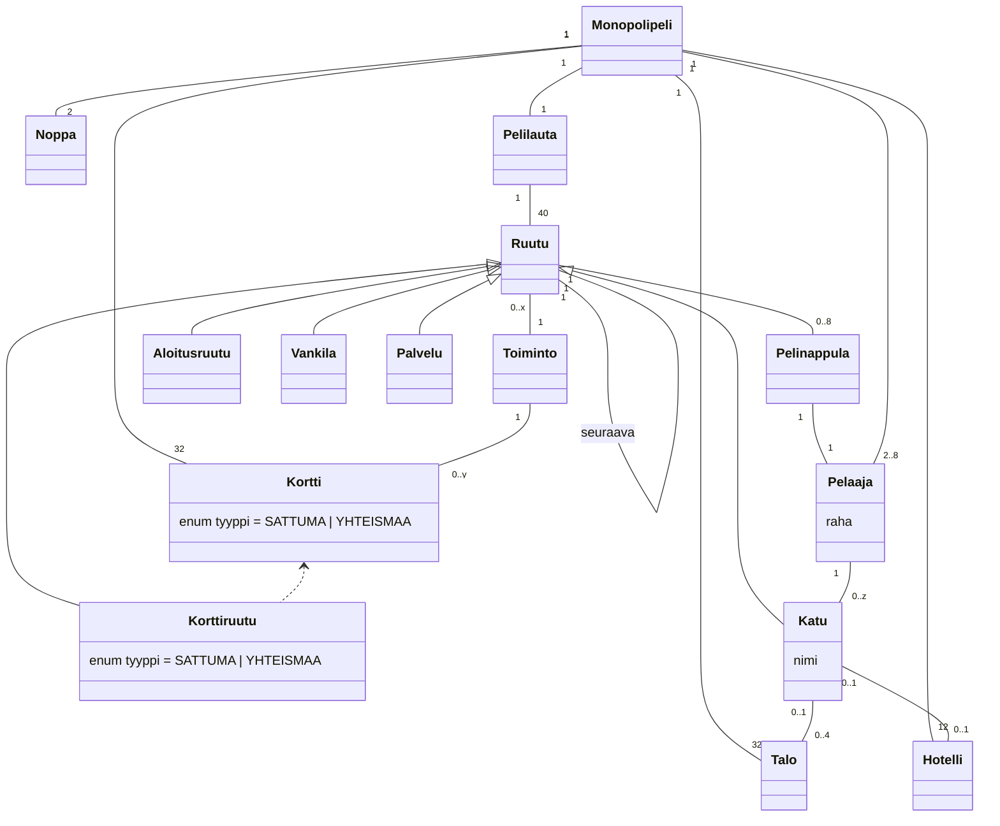

```mermaid
classDiagram
    Monopolipeli "1" -- "2" Noppa
    Monopolipeli "1" -- "1" Pelilauta
    Monopolipeli "1" -- "32" Kortti
    Monopolipeli "1" -- "32" Talo
    Monopolipeli "1" -- "12" Hotelli
    Toiminto "1" -- "0..y" Kortti
    Pelinappula "1" -- "1" Pelaaja
    Pelaaja "2..8" -- "1" Monopolipeli
    Pelilauta "1" -- "40" Ruutu
    Ruutu "0..x" -- "1" Toiminto
    Ruutu <|-- Aloitusruutu
    Ruutu <|-- Vankila
    Ruutu <|-- Korttiruutu
    Ruutu <|-- Palvelu
    Ruutu <|-- Katu
    Kortti <.. Korttiruutu
    Ruutu "1" -- "0..8" Pelinappula
    Ruutu "1" -- "1" Ruutu : seuraava
    Pelaaja "1" -- "0..z" Katu
    Katu "0..1" -- "0..4" Talo
    Katu "0..1" -- "0..1" Hotelli
    class Katu {
        nimi
    }
    class Pelaaja {
        raha
    }
    class Korttiruutu {
        enum tyyppi = SATTUMA | YHTEISMAA
    }
    class Kortti {
        enum tyyppi = SATTUMA | YHTEISMAA
    }
```
